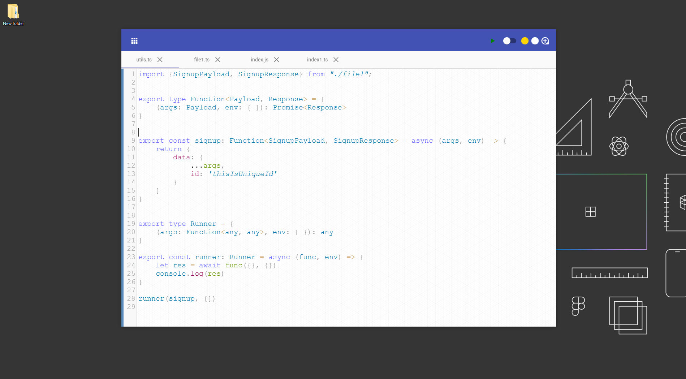
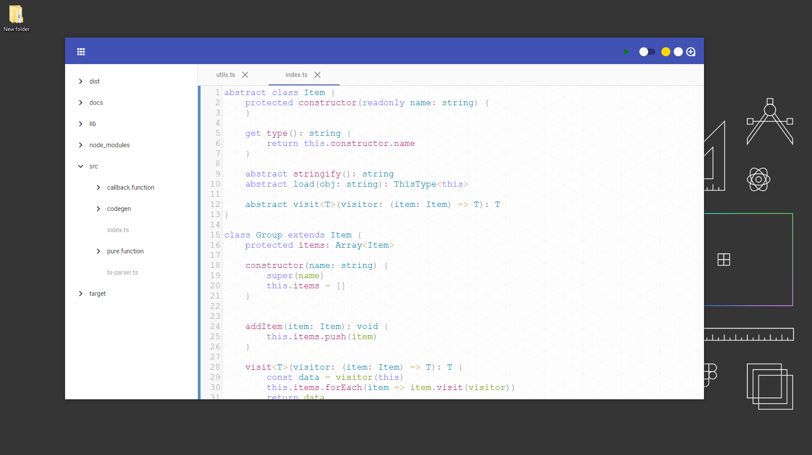
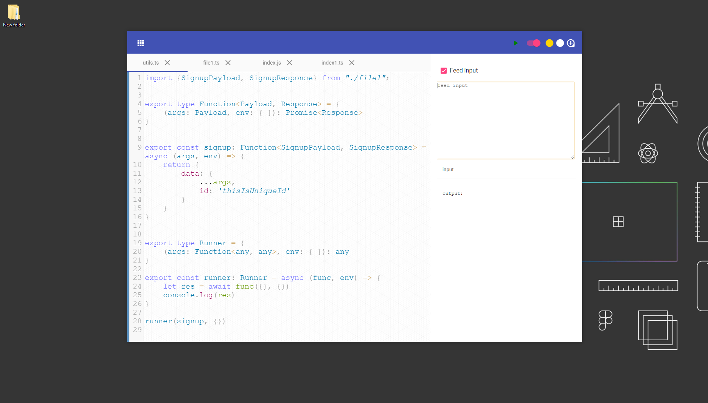

# codeslash

This app is build on [Angular CLI](https://github.com/angular/angular-cli) version 7.2.2
and [Electron](https://github.com/electron/electron) version 4.0.3.

## Run on development mode
We need these two commands:
1.) Run `npm run start` for a dev server.
2.) Run `npm run electron` to run our electron app. The app will automatically reload if you change any of the source files.

